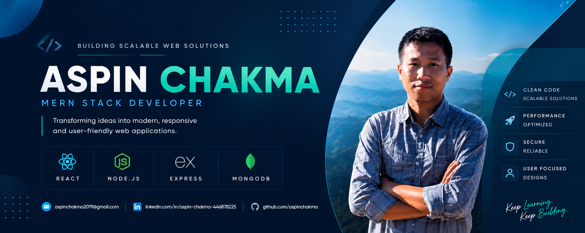
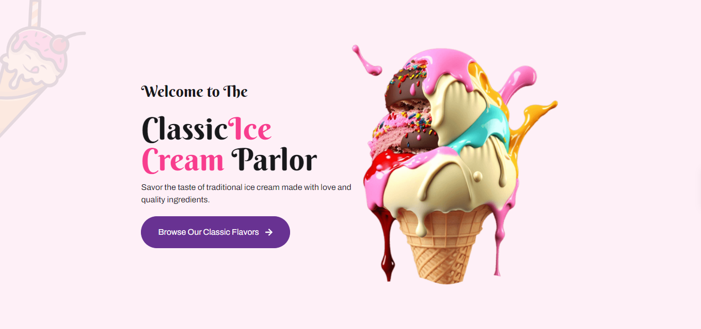
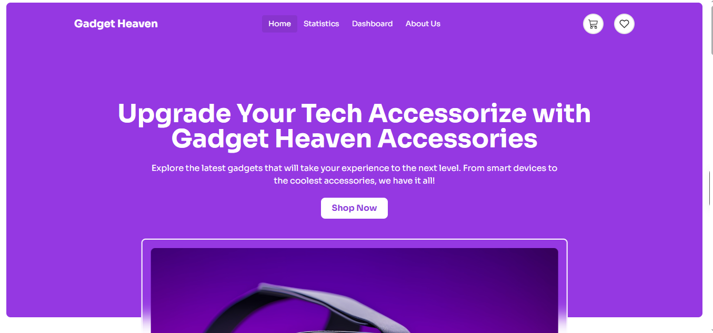

  

<h1 align="center">Hi, I'm Aspin Chakma 👋</h1>

  

---

## 🚀 About Me

- 💻 **MERN Stack Developer** based in Bangladesh, focused on building performant web applications.
- 📄 <b>Resume:</b> <a href="https://docs.google.com/document/d/1A7DvpLSaPE2lkjr_nSJfSfcAT0b3MkwuDqht7z-2WTc/edit?usp=sharing" target="_blank"><u>View / Download PDF Resume</u></a>

- 🌱 **Currently Elevating:** TypeScript, Next.js, and Scalable Backend Architecture.
- 🎯 **Career Focus:** Software Engineering roles (Full-time & Remote opportunities).
- ⚡ **Core Strength:** Turning functional ideas into clean-coded, production-ready products.

---

## 🛠 Tech Stack

### Frontend

### Backend

### Database & Authentication

 

### Tools

 

---

## 🚀 Featured Projects

### 🍦 Icy Tales — Modern React Single Page Application

**🔗 Links** | [🌐 Live Preview](https://icy-tales.netlify.app/) | [💻 Source Code](https://github.com/aspinchakma/icy-tales)

  

#### ✨ Key Features

- Dynamic product and blog routing with React Router
- Product & blog details pages powered by dynamic data
- Fully functional shopping cart system
- Increase, decrease, remove, and clear cart items
- Persistent cart data using Local Storage
- Search validation with user-friendly feedback
- Graceful error handling and custom 404 pages
- Mobile-first responsive design

#### 🛠 Tech Stack

  
  
  
  
  
  

---

### 🛒 Gadget Heaven — Modern E-commerce Platform

**🔗 Links** | [🌐 Live Preview](https://gadget-heaven-gadget.netlify.app/) | [💻 Source Code](https://github.com/aspinchakma/gadget-heaven)

  

#### ✨ Key Features

- Multi-page responsive e-commerce experience
- Product details page with dynamic routing
- Add-to-cart and wishlist management
- Real-time cart and wishlist counters
- Persistent data storage using Local Storage
- Automatic navigation after cart actions
- Purchase flow with cart clearing functionality
- Skeleton loading screens for enhanced UX
- Custom 404 page and error handling

#### 🛠 Tech Stack

  
  
  
  
  
 
 

---

### ⌚ Marotic — Online Watch Shop

**🔗 Links** | [🌐 Live Preview](https://marotic-7e06a.web.app/) | [💻 Client Code](https://github.com/aspinchakma/MAROTIC_CLIENT) | [⚙️ Server Code](https://github.com/aspinchakma/MAROTIC_SERVER)

#### ✨ Key Features

- Role-based Admin & User Dashboard
- Product Management System
- Secure Firebase Authentication
- Order Management Functionality
- Responsive User Interface

#### 🛠 Tech Stack

  
  
  
  

---

### 🍔 Foodota — Online Food Delivery Platform

**🔗 Links** | [🌐 Live Preview](https://foodota-c3eb8.web.app/) | [💻 Client Code](https://github.com/aspinchakma/FOODOTA_CLIENT) | [⚙️ Server Code](https://github.com/aspinchakma/FOODOTA_SERVER)

#### ✨ Key Features

- Restaurant Management System
- Food Ordering Workflow
- User Authentication
- Admin Dashboard
- Responsive Design

#### 🛠 Tech Stack

  
  
  
  
  
  

---

### 💊 Medicine — Online Pharmacy Platform

**🔗 Links** | [🌐 Live Preview](https://pharmacy-60bec.web.app/) | [💻 Client Code](https://github.com/aspinchakma/MEDISINE)

#### ✨ Key Features

- Online Medicine Ordering
- Authentication System
- Responsive Design
- Easy Product Browsing
- Accessible Anywhere

#### 🛠 Tech Stack

  
  
  
  
  
  

---

### 📈 GitHub Analytics

  

  <!-- Snake Container with Dark/Light Mode Auto-Switching -->
<picture>
  <source media="(prefers-color-scheme: dark)" srcset="https://raw.githubusercontent.com/aspinchakma/aspinchakma/output/snake-purple.svg">
  <source media="(prefers-color-scheme: light)" srcset="https://raw.githubusercontent.com/aspinchakma/aspinchakma/output/snake.svg">
  
</picture>

<h4 align="center">Thanks for visiting my profile 🚀</h4>
